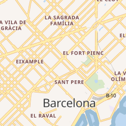

# Concepto de tesela vectorial

!!! tip "Presentación"
    Ver este capítulo en [formato presentación](../presentacion/)
    

## Estándares de codificación de las teselas vectoriales


Transformación de una capa de datos a una tesela de imagen o tesela vectorial

| Teselas vectoriales | Teselas de imagen |
|---|---|
|Estilo se define en el cliente|Estilo se define en el servidor|
|Sólo se necesita teselar la información una sola vez y se pueden tener múltiples mapas|Hay que teselas la información para cada mapa|
|*Overzoom* se mantiene resolución|*Overzoom* pierde resolución (pixelado)|
|Menor tamaño (se recomienda máximo 500kb)|Más fáciles de consumir|
|Cache ocupa mucho menos espacio. Fáctible el uso en dispositivos móviles sin conexión|Cache ocupa mucho espacio. Uso en dispositivos móviles requiere mucho espacio de disco|
|Acceso nativo a la información del objeto (atributos y geometría), lo que permite un procesamiento muy sofisticado||
|Se ven mejor en dispositivos de alta resolución||


Comparativa pesos teselas vector vs imagen. Fuente https://plot.ly/~mourner/118.embed

### Overzoom

*Overzooming* es una técnica específica de teselas vectorial que permite que una tesela se represente más allá de su nivel de zoom previsto, por lo que continúa siendo visible en el mapa. Si un conjunto de teselas tiene un minzoom de 6 y un maxzoom de 12, esos son los rangos válidos calculados por el generador de teselas. Si ampliara el mapa más allá del nivel de zoom 12, el renderizador del mapa puede seguir utilizando los datos del zoom 12 escalando los datos del vector hacia arriba. Esto, por supuesto, puede dar lugar a grandes simplificaciones de datos si las geometrías se representan demasiado por encima de su nivel real de detalle.

Las teselas imagen pierden claridad si ocurre overzoom. Por ejemplo, si está visualizando un conjunto de teselas imagen con una extensión de zoom entre z0 y z6, si hace un zoom a un nivel de zoom más alto después de z6, las imágenes se volverán borrosas y difíciles de ver.

Los efectos del overzoom no son tan notables con las teselas vector, ya que los datos vectoriales no se almacenan en un formato basado en píxeles, sino que se codifican y calculan a partir de una serie de puntos, líneas y polígonos.


Overzoom nivel zoom 16 vs nivel zoom 19.

## Codificación

Las geometrías y los atributos se codifican como datos binarios de Google Protobuf (PBF).

### Codificar geometrías

Para codificar información geográfica en una tesela vectorial, una herramienta debe convertir las coordenadas geográficas, como la latitud y la longitud, en coordenadas vectoriales de cuadrículas. Las teselas de vectoriales no tienen ningún concepto de información geográfica. Codifican puntos, líneas y polígonos como pares x/y relativos a la esquina superior izquierda de la cuadrícula de forma descendente.

Las geometrías son transformadas a una sola tesela, con un sistema de coordenadas de píxel local, que por defecto va de la esquina superior izquierda (0,0) a la esquina inferior derecha (4096,4096).


Codificar geometría. Fuente https://www.mapbox.com/vector-tiles/specification/#encoding-geom

### Codificar atributos

Los atributos se codifican como un conjunto único de claves (algo así como un esquema de campos de capa) y la lista de sus valores.

Los atributos están codificados en una serie de etiquetas que existen dentro de un elemento en el vector que tienen valores enteros que hacen referencia a las claves y los valores que provienen de la geometría. Esto elimina la redundancia de los atributos para geometrías que tienen las mismas claves y valores similares.


Codificar atributos. Fuente https://www.mapbox.com/vector-tiles/specification/#encoding-attr

### Winding order

El *Winding order* (dirección de digitalización) se refiere a la dirección en que se dibuja un anillo en un mosaico vectorial, ya sea en sentido horario o antihorario. Muchas geometrías son multipolígonos con "agujeros", que también se representan como anillos de polígono. Es importante poder inferir el orden al extraer datos fuente de un mosaico vectorial y comprender si la geometría es parte de un polígono múltiple o un polígono único.

Para que los procesadores distingan de manera apropiada que polígonos son agujeros y cuáles son geometrías únicas, la especificación requiere que todos los polígonos sean válidos (validez de OGC). Cualquier anillo interior poligonal debe orientarse con el orden opuesto al de su anillo exterior principal y todos los anillos interiores deben seguir directamente el anillo exterior al que pertenecen. Los anillos exteriores deben estar orientados en el sentido de las agujas del reloj y los anillos interiores deben estar orientados en sentido contrario a las agujas del reloj.


Winding order. Fuente https://www.mapbox.com/vector-tiles/specification/#winding-order

## Diferentes especificaciones y conceptos relacionados con las teselas vectoriales

### pbf

**Protocol buffers** (pbf) desarrollado por Google (para uso interno) es un método para serializar datos estructurados. Es *language-neutral*, *platform-neutral* y en cuyo objetivo de diseño enfatizaron la simplicidad y el rendimiento.

El método implica un lenguaje de descripción de interfaz (`.proto`) que describe la estructura de algunos datos y un programa que genera código fuente a partir de esa descripción para generar o analizar una secuencia de bytes que representa los datos estructurados.

### mvt

Formato binario basado en la especificación de Mapbox que usa **pbf** para serializar datos geográficos. Los archivos deberían tener extensión .mvt pero no es obligatorio así que se pueden encontrar archivos con extensión .pbf, .vector.pbf o .mvt.gz (compresión gzip)

Por ejemplo un conjunto de teselas mvt almacenadas en un SQLite siguiendo una esquema específico formaría un MBTiles.


## Caso práctico: Generando teselas vectoriales con PostGIS

Desde PostGIS 2.4.0 existe la función `ST_AsMVT` para generar teselas directamente con SQL.

A partir de los recursos de este enlace:
  
   https://github.com/geomatico/taller-vt-jiide/tree/master/ejercicios/01

1. Cargar la base de datos `vt_dump`, que contiene los barrios de Barcelona, mediante psql. El comando sería:

        psql -U postgres -W < vt_dump.sql
    
2. Conectándonos a la nueva base de datos `vt` con el usuario `vt` y password `vt`:

    * Creamos una función auxiliar que calcula el BBOX de una tesela en función de los parámetros (x, y, z):

        ```postgresql
        CREATE OR REPLACE FUNCTION BBox(z integer, x integer, y integer)
            RETURNS geometry AS
        $BODY$
        DECLARE
            max numeric := 6378137 * pi();
            res numeric := max * 2 / 2^z;
        BEGIN
            return ST_MakeEnvelope(
                -max + (x * res),
                max - (y * res),
                -max + (x * res) + res,
                max - (y * res) - res,
                3857);
        END;
        $BODY$
          LANGUAGE plpgsql;
        ```
        
    * Ejecutamos la consulta que nos devuelve la tesela de zoom=13, x=4145 e y=3059, de la siguiente manera:
        
        ```postgresql
        SELECT ST_AsMVT(q, 'mvt_barrios')
        FROM (
          SELECT gid, n_barri,
            ST_AsMVTGeom(
              geom,
              BBox(13, 4145, 3059),
              4096,
              0
            ) AS geom
          FROM barrios
          WHERE geom && BBox(13, 4145, 3059)
        ) AS q;
        ```

La tesela resultante correspondería a este área de Barcelona:



Obviamente, generar una sola tesela no tiene sentido. Pero ya tenemos la pieza principal para construir un generador de pirámides de teselas,
o construir un servicio web de tipo `{z}/{x}/{y}`.

Esta capacidad la utilizan múltiples implementaciones, entre ellas el generador de teselas de OpenMapTiles, llamado
[postserve](https://github.com/openmaptiles/postserve/blob/master/server.py#L27).
