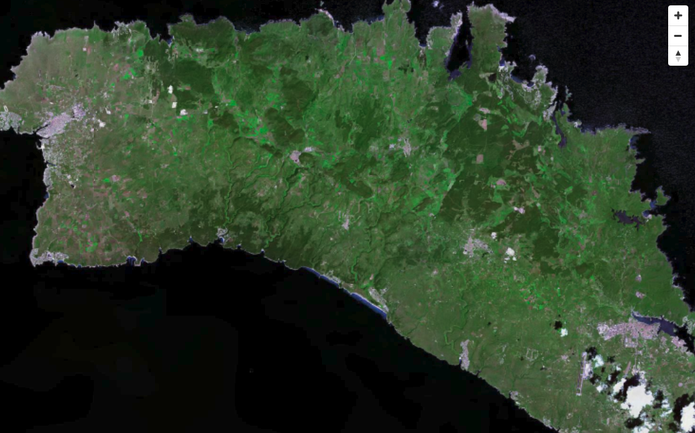
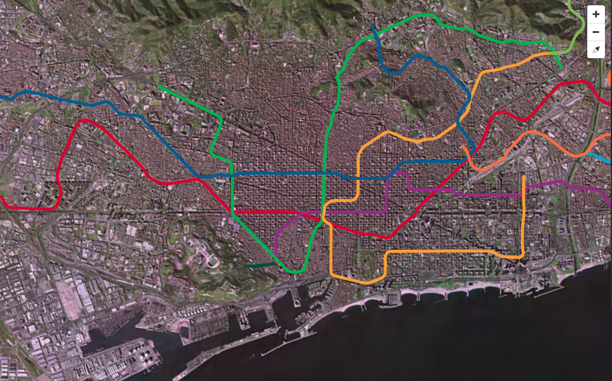

# Integración de las teselas vectoriales con servicios estándar OGC

Las teselas vectoriales están pensadas para su *visualización*, **no son un servicio de descarga**. Por tanto, la
manera de servirlas mediante estándares OGC es usando WMTS para la versión teselada, e incluso WMTS si quisiéramos
servir el mismo formato pero sin el teselado.

En definitiva, podríamos considerar las teselas vectoriales como un nuevo formato de "imagen". Igual que tenemos
`image/jpeg` o `image/png`, podríamos incluír un nuevo tipo MIME en las capabilities de nuestros servicios WMS y WMTS
que sirviera los datos codificados en MVT.

Esto es precisamente lo que hace la [extensión Vector Tiles de GeoServer](https://docs.geoserver.org/stable/en/user/extensions/vectortiles/install.html)
cuando define el nuevo tipo MIME:

    application/x-protobuf;type=mapbox-vector

## Caso práctico: La extensión Vector Tiles de GeoServer

1. Entrar en http://demo.fonts.cat/geoserver/

2. Explorar el GetCapabilities del servicio WMS. Buscar cómo están anunciadas las capas de teselas vectoriales.

3. Explorar las Capabilities de los servicios WMTS, TMS y WMS-C, y comprobar si existen capas de teselas vectoriales.

4. Entrar como administrador, y observar cómo está configurado GeoWebCaché para las capas que sirven teselas vectoriales.

5. Discutir ventajas y limitaciones de GeoServer.


### Ejemplos de integración con otros servicios de OGC

#### WMS:

```json
    'sources': {
      'wms-source': {
        'type': 'raster',
        'tiles': [
          'http://www.ign.es/wms-inspire/pnoa-ma?bbox={bbox-epsg-3857}&format=image/jpeg&service=WMS&version=1.1.1&request=GetMap&srs=EPSG:3857&width=256&height=256&layers=OI.OrthoimageCoverage'
        ],
        'tileSize': 256
      }
    },
    'layers': [{
      'id': 'wms-layer',
      'type': 'raster',
      'source': 'wms-source'
    }]
```

[**DEMO** WMS imagen](../ejemplos/wms-pnoa.html)



#### WMTS: 

```json
    'sources': {
      'wmts-source': {
        'type': 'raster',
        'tiles': [
          'http://www.ign.es/wmts/pnoa-ma?Layer=OI.OrthoimageCoverage&Style=default&TileMatrixSet=GoogleMapsCompatible&Service=WMTS&Request=GetTile&Version=1.0.0&Format=image/jpeg&TileMatrix={z}&TileCol={x}&TileRow={y}'
        ],
        'tileSize': 256
      }
    },
    'layers': [{
      'id': 'wmts-layer',
      'type': 'raster',
      'source': 'wmts-source'
    }]
```

[**DEMO** WMTS imagen](../ejemplos/wmts-pnoa.html)


#### WFS:

```json
    'sources': {
      'geojson-source': {
        'type': 'geojson',
        'data': 'http://demo.fonts.cat/geoserver/wfs?SERVICE=WFS&VERSION=1.1.0&REQUEST=GetFeature&TYPENAME=TMB:LINIES_METRO&outputFormat=json&srsName=EPSG:4326'
      }
    },
    'layers': [{
      'id': 'geojson-layer',
      'type': 'line',
      'source': 'geojson-source',
      'paint': {
        'line-width': 5,
        'line-color': ['concat', '#', ['get', 'COLOR_LINIA']]
      }
    }]
```

[**DEMO** WMTS imagen + WFS GeoJSON](../ejemplos/wfs-geojson.html)




#### Teselas Vectoriales como TMS:

```json
    'sources': {
      'vectortile-tms-source': {
        'type': 'vector',
        'tiles': ['http://demo.fonts.cat:8000/geoserver/gwc/service/tms/1.0.0/TMB%3ALINIES_METRO@EPSG%3A900913@pbf/{z}/{x}/{y}.pbf'],
        'scheme': 'tms'
      }
    },
    'layers': [{
      'id': 'vectortile-layer',
      'type': 'line',
      'source': 'vectortile-tms-source',
      'source-layer': 'LINIES_METRO',
      'paint': {
        'line-width': 5,
        'line-color': ['concat', '#', ['get', 'COLOR_LINIA']]
      }
    }]
```

[**DEMO** WMTS imagen + Vector Tile TMS](../ejemplos/tms-vector.html)
