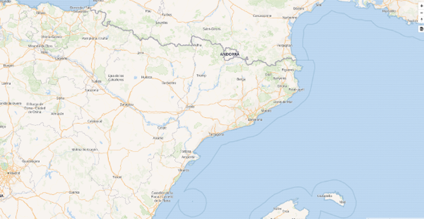

# Cómo visualizar teselas vectoriales

## Servidor web

Para ver las aplicaciones que desarrollaremos durante el taller necesitamos publicarlas mediante un servidor web.
En nuestro caso usaremos `live-server`, que permite servir los contenidos de un directorio y recargar la página
automáticamente cuando se modifica el contenido de algún fichero.

Para instalarlo, se usará el comando:

```bash
npm install -g live-server
```

Para arrancarlo, basta con situarse en el directorio que queramos servir y ejecutar:

```bash
mkdir taller-vt
cd taller-vt
live-server
```

Se abrirá el navegador por defecto con la dirección http://127.0.0.1:8080/
y se mostrará el contenido del directorio para poder navegar por él.

Deja la ventana del terminal abierta, y usa la combinación de teclas `Ctrl` + `C` para parar el servidor.


## Hola Mundo

Vamos a crear un fichero `barcelona.html`.

Abre una nueva ventana de terminal (recuerda dejar el servidor activo) y ejecuta Visual Studio Code
(o el editor que prefieras):

```bash
code .
```

Crea un fichero `barcelona.html`:

```html
<!DOCTYPE html>
<html>
<head>
    <meta charset="UTF-8">
    <meta name="viewport" content="width=device-width, initial-scale=1">
    <title>Mapa VT</title>
</head>
<body id="map">
    Hola mundo
</body>
</html>
```

Recargar la página http://127.0.0.1:8080/ en el navegador. Se debería ver un "Hola mundo".


## Hola Mapa

En este primer ejemplo crearemos un visor de mapas utilizando la librería de Mapbox GL JS.
Tanto los datos procedente de teselas vectoriales ó vector tiles (VT) como el estilo para
simbolizar los mismos se encuentran en la red.

Modificar el archivo `barcelona.html` para que contenga el siguiente código:

```html hl_lines="7 8 9 10 11 12 13 14 17 18 19 20 21 22 23 24 25 26 27 28 29"
<!DOCTYPE html>
<html>
<head>
    <meta charset="UTF-8">
    <meta name="viewport" content="width=device-width, initial-scale=1">
    <title>Mapa VT</title>
    <link rel='stylesheet' href='https://api.tiles.mapbox.com/mapbox-gl-js/v0.44.1/mapbox-gl.css' />
    <script src='https://api.tiles.mapbox.com/mapbox-gl-js/v0.44.1/mapbox-gl.js'></script>
    <style>
        html, body {
            margin: 0;
            height: 100%;
        }
    </style>
</head>
<body id='map'>
<script>
    var map = new mapboxgl.Map({
        container: 'map', // id del elemento HTML que contendrá el mapa
        style: 'https://openmaptiles.github.io/osm-bright-gl-style/style-cdn.json', // Ubicación del estilo
        center: [2.175, 41.39], // Ubicación inicial
        zoom: 13, // Zoom inicial
        bearing: -45, // Ángulo de rotación inicial
        hash: true // Permite ir guardando la posición del mapa en la URL
    });
    
    // Agrega controles de navegación (zoom, rotación) al mapa:
    map.addControl(new mapboxgl.NavigationControl());
</script>
</body>
</html>
```


Resultado visor simple

## Inspector de datos

El control [mapbox-gl-inspect](https://github.com/lukasmartinelli/mapbox-gl-inspect) permite ver todos los elementos
de un VT y también permite pasar el cursor sobre los elementos para ver sus propiedades.

Agregar el código de la librería, e instanciar el control tras crear el mapa:


```html hl_lines="9 10 32 33"
<!DOCTYPE html>
<html>
<head>
    <meta charset="UTF-8">
    <meta name="viewport" content="width=device-width, initial-scale=1">
    <title>Mapa VT</title>
    <link rel='stylesheet' href='https://api.tiles.mapbox.com/mapbox-gl-js/v0.44.1/mapbox-gl.css' />
    <script src='https://api.tiles.mapbox.com/mapbox-gl-js/v0.44.1/mapbox-gl.js'></script>
    <link href='https://mapbox-gl-inspect.lukasmartinelli.ch/dist/mapbox-gl-inspect.css' rel='stylesheet' />
    <script src='https://mapbox-gl-inspect.lukasmartinelli.ch/dist/mapbox-gl-inspect.min.js'></script>
    <style>
        html, body {
            margin: 0;
            height: 100%;
        }
    </style>
</head>
<body id='map'>
<script>
    var map = new mapboxgl.Map({
        container: 'map', // id del elemento HTML que contendrá el mapa
        style: 'https://openmaptiles.github.io/osm-bright-gl-style/style-cdn.json', // Ubicación del estilo
        center: [2.175, 41.39], // Ubicación inicial
        zoom: 13, // Zoom inicial
        bearing: -45, // Ángulo de rotación inicial
        hash: true // Permite ir guardando la posición del mapa en la URL
    });
    
    // Agrega controles de navegación (zoom, rotación) al mapa:
    map.addControl(new mapboxgl.NavigationControl());
    
    // Agregar el control de inspección
    map.addControl(new MapboxInspect());
</script>
</body>
</html>
```

Se recargará la página en el navegador con un nuevo botón que permite la "visión de rayos X" sobre los datos.


Inspect


## Contenido de un fichero de estilo

Como vemos, el visor es muy sencillo, y parece que toda la "magia" se esconde en el fichero de estilo tras la URL
`https://openmaptiles.github.io/osm-bright-gl-style/style-cdn.json`.

Si lo abrimos, es un objeto JSON bastante complejo, pero si nos fijamos en las propiedades de primer nivel, son pocas.
Las principales: 

```json
{
  "version": 8,
  "name": "OSM Bright",
  "sprite": "https://openmaptiles.github.io/osm-bright-gl-style/sprite",
  "glyphs": "https://free.tilehosting.com/fonts/{fontstack}/{range}.pbf?key=RiS4gsgZPZqeeMlIyxFo",
  "sources": {...},
  "layers": [...]
}
```

* `version` es obligatoria y siempre es 8.
* `name` es opcional pero conveniente, es una etiqueta para mostrar el nombre del estilo. 
* `sprite` indica de dónde obtener el conjunto de **iconos** necesarios para simbolizar.
* `glyphs`: indica de dónde obtener el conjunto de **tipografías** necesarios para simbolizar.
* `sources`: los orígenes de datos.
* `layers`: las reglas de simbolización. El orden es importante: Se van dibujando de la primera (que queda por debajo)
a la última (que queda por encima). Así, la primera regla suele ser el color de fondo del mapa, y las últimas suelen
ser la toponimia o los PoIs.

En los próximos capítulos veremos en detalle cómo usar `sources`, `layers`, `sprites` y `glyphs`.

Habitualmente también se usan otras propiedades para indicar la vista inicial del mapa. Por ejemplo:

```json
{
  ...
  "center": [2.15, 41.39],
  "zoom": 12,
  "bearing": -45,
  "pitch": 0
}
```

* `center`: Coordenadas iniciales donde centrar el mapa [lon, lat]
* `zoom`: Zoom inicial del mapa
* `bearing`: Rotación inicial del mapa (en grados)
* `pitch`: Inclinación inicial del mapa para verlo en perspectiva (de 0 a 60 grados)

!!! tip
    La especificación completa del fichero de estilo es parte de la [documentación on-line de Mapbox GL
    JS](https://www.mapbox.com/mapbox-gl-js/style-spec/).
