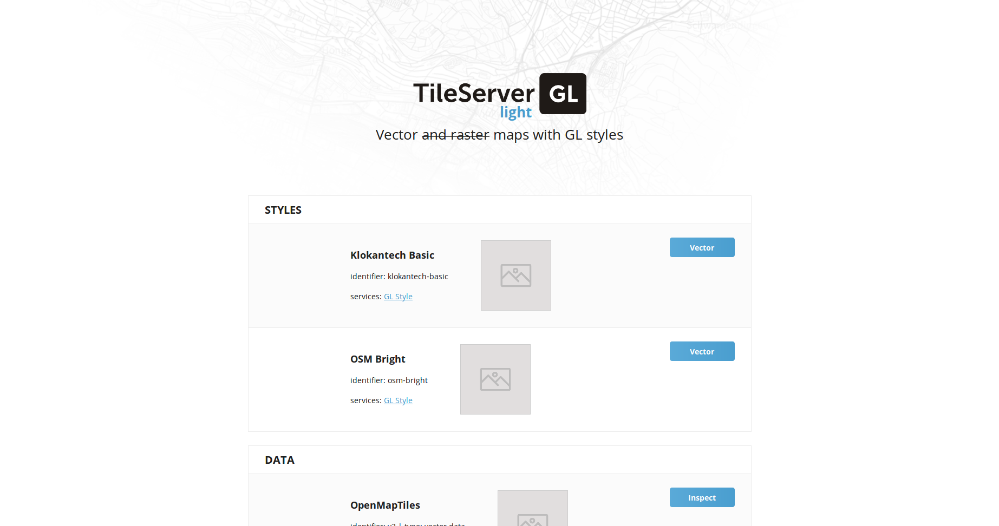
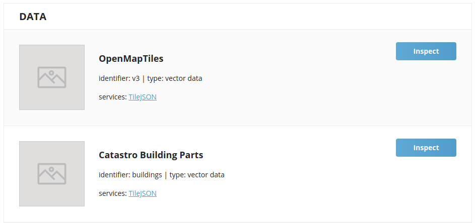
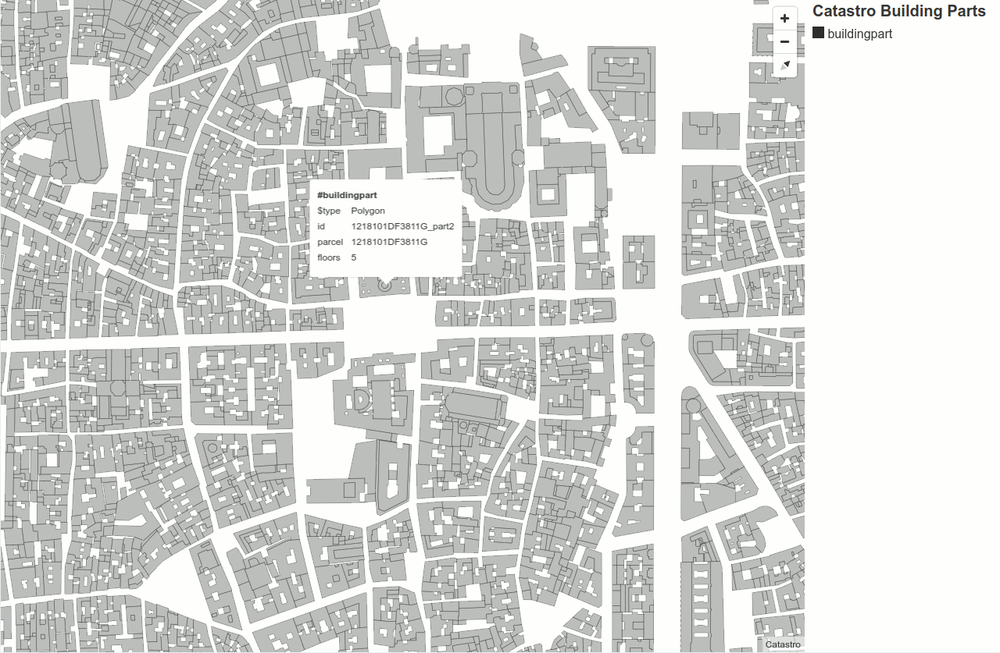
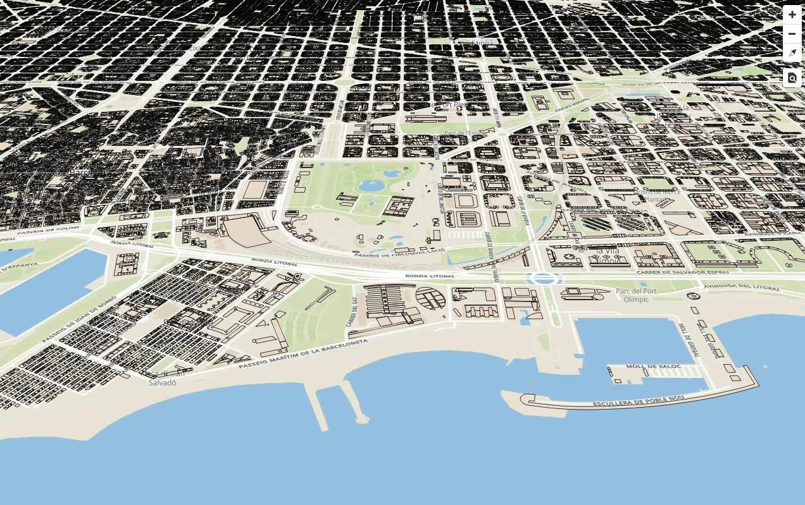
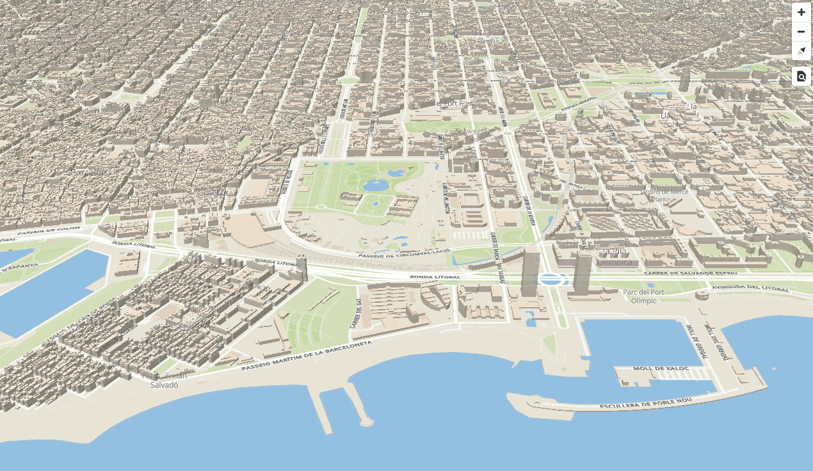

# Cómo servir teselas vectoriales

## Instalación de TileServer GL

[TileServer GL](http://tileserver.org/) es un servidor de mapas de código abierto creado para teselas vectoriales, y
capaz de renderizar en teselas raster con MapBox GL Native engine en el lado del servidor.

Proporciona mapas para aplicaciones web y móviles. Es compatibles con Mapbox GL JS, Android SDK, iOS SDK, Leaflet,
OpenLayers, HighDPI/Retina, SIG a través de WMTS, etc.

Si se quiere servir teselas raster lo mejor es utilizar la versión de Docker ya que son necesarias algunas librerías
nativas que pueden variar dependiendo de la plataforma, estas librerías sirven para renderizar las teselas vectoriales
en teselas raster. Si únicamente se quiere servir teselas vectoriales se puede utilizar el TileServer GL Light,
que no tiene ninguna dependencia nativa ya que está desarrollado en javascript.

Para este taller utilizaremos la versión Light ya que serviremos sólo teselas vectoriales.

Es necesario tener instalado [Node.js](https://nodejs.org/es/) versión 6.

!!! warning
    tileserver-gl-light NO se instalará correctamente si estamos usando una versión de Node.js superior a la 6.
    Debemos activar esta versión de node con el comando:

    ```bash
    nvm use 6
    node -v # Debería devolver: 6.x.x
    ``` 
 
Una vez comprobada la versión de node:

```bash
npm install -g tileserver-gl-light@2.3.1
tileserver-gl-light -v # Deberia devolver: v2.3.1 
```

## Arranque con la configuración por defecto

### Obtener datos de Barcelona

Crear una carpeta llamada `tileserver/data` y copiar en ella el fichero `datos/barcelona.mbtiles:
 
```bash
cd ~/Desktop/taller-vt
mkdir -p tileserver/data
cp datos/barcelona.mbtiles tileserver/data
```

!!! tip
    En la web de [OpenMapTiles](https://openmaptiles.com/downloads) se pueden descargar datos de muchas
    otras ciudades, países, e incluso el planeta entero. Es gratuíto, aunque hay que registrarse y los datos
    no están del todo actualizados. 

Ahora arrancaremos el servidor en el puerto `8081` (parámetro `-p`):

```bash
cd tileserver
tileserver-gl-light data/barcelona.mbtiles -p 8081
```

Abrir el navegador y escribir http://localhost:8081. Aparecerá la página del TileServer.

Dejar el terminal abierto con el servidor arrancado.


*TileServer GL Light*

### Modificar el visor de mapas

Modificaremos nuestro archivo `barcelona.html` para que el visor de mapas consuma las teselas vectoriales servidas por
 nuestro TileServer:

``` html hl_lines="22"
<!DOCTYPE html>
<html>
<head>
    <meta charset="UTF-8">
    <meta name="viewport" content="width=device-width, initial-scale=1">
    <title>Mapa VT</title>
    <link rel='stylesheet' href='https://api.tiles.mapbox.com/mapbox-gl-js/v0.44.1/mapbox-gl.css' />
    <script src='https://api.tiles.mapbox.com/mapbox-gl-js/v0.44.1/mapbox-gl.js'></script>
    <link href='https://mapbox-gl-inspect.lukasmartinelli.ch/dist/mapbox-gl-inspect.css' rel='stylesheet' />
    <script src='https://mapbox-gl-inspect.lukasmartinelli.ch/dist/mapbox-gl-inspect.min.js'></script>
    <style>
        html, body {
            margin: 0;
            height: 100%;
        }
    </style>
</head>
<body id='map'>
<script>
    var map = new mapboxgl.Map({
        container: 'map', // id del elemento HTML que contendrá el mapa
        style: 'http://localhost:8081/styles/osm-bright/style.json', // Ubicación del estilo
        center: [2.175, 41.39], // Ubicación inicial
        zoom: 13, // Zoom inicial
        bearing: -45, // Ángulo de rotación inicial
        hash: true // Permite ir guardando la posición del mapa en la URL
    });

    // Agrega controles de navegación (zoom, rotación) al mapa:
    map.addControl(new mapboxgl.NavigationControl());

    // Agregar el control de inspección
    map.addControl(new MapboxInspect());
</script>
</body>
</html>
```

## Configuración completa

Vamos a extraer un primer fichero de configuración. Para ello, debemos parar el servidor `tileserver-gl-light` y vamos
a arrancarlo de nuevo, pero esta vez con la opción `-V` (verbose):

```bash
tileserver-gl-light data/barcelona.mbtiles -p 8081 -V
```

Observaremos que nos responde "Automatically creating config file for barcelona.mbtiles", y a continuación nos muestra
el fichero de configuración que ha autogenerado, y que aproximadamente tendrá este aspecto:

```json
{
  "options": {
    "paths": {
      "root": "/home/siglibre/.nvm/versions/node/v6.14.2/lib/node_modules/tileserver-gl-light/node_modules/tileserver-gl-styles",
      "fonts": "fonts",
      "styles": "styles",
      "mbtiles": "/home/siglibre/Desktop/taller-vt/tileserver/data"
    }
  },
  "styles": {
    "klokantech-basic": {
      "style": "klokantech-basic/style.json",
      "tilejson": {
        "bounds": [-180, -85.0511, 180, 85.0511]
      }
    },
    "osm-bright": {
      "style": "osm-bright/style.json",
      "tilejson": {
        "bounds": [-180, -85.0511, 180, 85.0511]
      }
    }
  },
  "data": {
    "v3": {
      "mbtiles": "barcelona.mbtiles"
    }
  }
}
```

La configuración se divide en estos tres elementos:

* `options.paths`: Rutas de donde obtener los diferentes recursos: `mbtiles` (datos), `fonts` (también llamados `glyphs`), y `styles`.
* `styles`: Ficheros de estilos y alguna información adicional para generar el fichero auxiliar TileJSON.
* `data`: Origenes de datos. Apunta a los diferentes ficheros `.mbtiles` que queramos servir.

Copiemos la configuración que nos ha devuelto `tileserver-gl-light -V` en un nuevo fichero llamado `tileserver/config.json`.

!!! warning
    Atención a la ruta de `options.paths`, que puede variar ligeramente entre estos apuntes y la ruta en vuestra máquina,
    dependiendo de la versión exacta de node que tengáis instalada. Tened en cuenta esta discrepancia en la ruta para las
    próximas instrucciones. El resto de la configuración debería ser la misma. 

Por defecto `Tileserver GL` viene con dos estilos incorporados (`klokantech-basic` y `osm-bright`) y cuatro tipografías
(`Open Sans` en sus varintes `Regular`, `Italic`, `Bold` y `Semibold`), que se esconden en la ruta profunda indicada en
`options.paths.root`.

Vamos a copiar estos recursos en nuestro directorio de trabajo:

```bash
cd ~/Desktop/taller-vt/tileserver
cp -r /home/siglibre/.nvm/versions/node/v6.14.2/lib/node_modules/tileserver-gl-light/node_modules/tileserver-gl-styles/styles .
cp -r /home/siglibre/.nvm/versions/node/v6.14.2/lib/node_modules/tileserver-gl-light/node_modules/tileserver-gl-styles/fonts .
```

Comprobemos que en `~/Desktop/taller-vt/tileserver` tenemos tres directorios `data`, `fonts` y `styles`, y el fichero `config.json`.

Modifiquemos ahora el fichero `config.json` para apuntar a nuestros recursos:

```json hl_lines="4 5 6 7 14 20"
{
  "options": {
    "paths": {
      "root": "",
      "fonts": "fonts",
      "styles": "styles",
      "mbtiles": "data"
    }
  },
  "styles": {
    "klokantech-basic": {
      "style": "klokantech-basic/style.json",
      "tilejson": {
        "bounds": [1.898, 41.246, 2.312, 41.533]
      }
    },
    "osm-bright": {
      "style": "osm-bright/style.json",
      "tilejson": {
        "bounds": [1.898, 41.246, 2.312, 41.533]
      }
    }
  },
  "data": {
    "v3": {
      "mbtiles": "barcelona.mbtiles"
    }
  }
}
```

De paso hemos modificado el BBOX de los datos de Barcelona, que no estaba bien ajustado.

Ahora paramos y arrancamos tileserver de nuevo, sin más parámetros que el puerto, y leerá automáticamente la
configuración del nuevo fichero `config.json`:

```bash
tileserver-gl-light -p 8081
```

Tileserver deberá decir "Using specified config file from config.json". Si vamos a http://localhost:8081 deberíamos
ver lo mismo que antes, pero ahora podremos ir añadiendo y modificando los recursos (datos, estilos, tipografías e iconos)
 que servimos.


## Añadiendo datos de edificios

Vamos a copiar un nuevo `.mbtiles` con información de edificios:

```bash
cp ../datos/buildings.mbtiles data/
```

Y lo vamos a añadir al fichero `config.json`:

```json hl_lines="28 29 30"
{
  "options": {
    "paths": {
      "root": "",
      "fonts": "fonts",
      "styles": "styles",
      "mbtiles": "data"
    }
  },
  "styles": {
    "klokantech-basic": {
      "style": "klokantech-basic/style.json",
      "tilejson": {
        "bounds": [1.898, 41.246, 2.312, 41.533]
      }
    },
    "osm-bright": {
      "style": "osm-bright/style.json",
      "tilejson": {
        "bounds": [1.898, 41.246, 2.312, 41.533]
      }
    }
  },
  "data": {
    "v3": {
      "mbtiles": "barcelona.mbtiles"
    },
    "buildings": {
      "mbtiles": "buildings.mbtiles"
    }
  }
}
```

Paramos el servidor y arrancamos de nuevo. Recargando la página http://localhost:8081 veremos el nuevo dataset:



Haciendo click en "Preview":



Efectivamente, se trata de una capa con más de 500.000 construcciones de catastro, con la referencia de la parcela
catastral a la que pertenece cada construcción, y el número de plantas para cada construcción. 

!!! question
    ¿Para qué sirve el "TileJSON" de un dataset?
    
    En última instancia, las teselas vectoriales se sirven en un servicio HTTP con una URL que acaba en `/{z}/{x}/{y}.pbf`.

    De hecho, en el estilo de mapbox podemos indicar esta url directamente, así:
    
    ```json
    "sources": {
        ...
        "buildings", {
            "type": "vector",
            "tiles": ["http://localhost:8081/data/buildings/{z}/{x}/{y}.pbf"]
        }
    }
    ```
    
    Aunque el método preferido es apuntar a un TileJSON. Esta configuración sería equivalente a la anterior, pero más correcta:
    ```json
    "sources": {
        ...
        "buildings", {
            "type": "vector",
            "url": "http://localhost:8081/data/buildings.json"
        }
    }
    ```

    El fichero TileJSON acaba teniendo una propiedad "tiles" que apunta al servicio XYZ, pero además contiene otros
    metadatos útiles para quien consume el dataset. Por ejemplo, el rango de niveles de zoom válidos para el dataset
    (`minzoom`, `maxzoom`) y el bbox válido (`bounds`), lo que evita hacer peticiones fuera de rango al servidor, y
    otros metadatos como las "capas" contenidas en cada Vector Tile, y los atributos de cada capa. Esto ayuda a funcionar
    al `InspectorPlugin`, y también nos da información a la hora de simbolizar la capa, ya que nos describe el esquema
    de los datos.

## Añadiendo los nuevos datos al visor

Para visualizar los datos de edificios en `barcelona.html`, usar el siguiente código javascript:

```html hl_lines="4 5 6 7 8 12 13 14 15 16 17 18 19 20 21 22 23 24 25 26 27 28 29"
<script>
    var map = new mapboxgl.Map({
        container: 'map', // id del elemento HTML que contendrá el mapa
        style: 'http://localhost:8081/styles/klokantech-basic/style.json',
        center: [2.19224, 41.38585],
        zoom: 15,
        bearing: -45,
        pitch: 60,
        hash: true
    });

    map.on('load', function() {
        map.addSource("buildings", {
            "type": "vector",
            "url": "http://localhost:8081/data/buildings.json"
        });

        map.addLayer({
            "id": "buildings",
            "source": "buildings",
            "source-layer": "buildingpart",
            "type": "fill",
            "paint": {
                "fill-opacity": 0.75,
                "fill-color": "#E9DFCD",
                "fill-outline-color": "#000"
            }
        });
    });

    // Agrega controles de navegación (zoom, rotación) al mapa:
    map.addControl(new mapboxgl.NavigationControl());

    // Agregar el control de inspección
    map.addControl(new MapboxInspect());
</script>
```



Incluso podemos usar una regla de simbolización de extrusión para verlos en 3D:

```html hl_lines="22 24 25 26"
<script>
    var map = new mapboxgl.Map({
        container: 'map', // id del elemento HTML que contendrá el mapa
        style: 'http://localhost:8081/styles/klokantech-basic/style.json',
        center: [2.19224, 41.38585],
        zoom: 15,
        bearing: -45,
        pitch: 60,
        hash: true
    });

    map.on('load', function() {
        map.addSource("buildings", {
            "type": "vector",
            "url": "http://localhost:8081/data/buildings.json"
        });

        map.addLayer({
            "id": "buildings",
            "source": "buildings",
            "source-layer": "buildingpart",
            "type": "fill-extrusion",
            "paint": {
                "fill-extrusion-opacity": 0.75,
                "fill-extrusion-color": "#E9DFCD",
                "fill-extrusion-height": ["*", 3, ["get", "floors"]]
            }
        });
    });

    // Agrega controles de navegación (zoom, rotación) al mapa:
    map.addControl(new mapboxgl.NavigationControl());

    // Agregar el control de inspección
    map.addControl(new MapboxInspect());
</script>
```

En la regla de simbolización hemos utilizado como altura de la extrusión el número de plantas multiplicado por 3.


