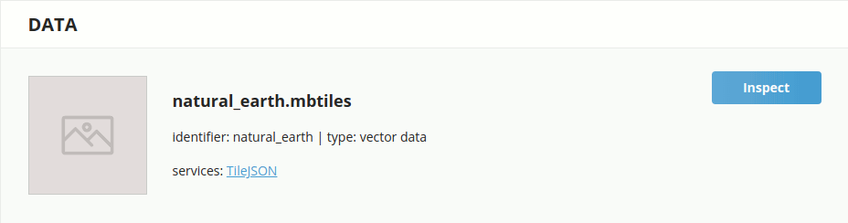
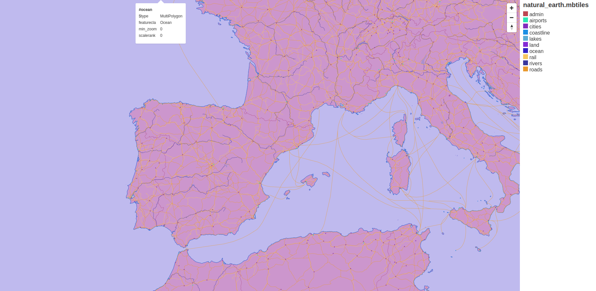

# Cómo crear teselas vectoriales

## Tippecanoe

Herramienta que permite crear tesalas vectoriales de colecciones grandes (o pequeñas) de elementos GeoJSON, Geobuf o CSV.

El objetivo de Tippecanoe es permitir una visión de sus datos independiente de la escala, de modo que en cualquier nivel desde el mundo entero hasta un solo edificio, podamos ver la densidad y la textura de los datos en lugar de una simplificación para eliminar características supuestamente sin importancia o agrupándolos o agregándolos.

Algunos ejemplos:

- Si le da todo OpenStreetMap y alejas la vista, le devolverá algo que se parece a "Todas las calles" en lugar de algo que parece un atlas de carretera interestatal.

- Si le das todas las huellas de edificios en Los Ángeles y alejas la vista lo suficiente como para que la mayoría de los edificios individuales ya no sean perceptibles, aún deberías poder ver la extensión y variedad del desarrollo en cada vecindario, no solo en los edificios más grandes del centro.

### Instalación

Para instalar Tippecanoe en Ubuntu lo más fácil es compilarlo desde el repositorio fuente. Abrimos un terminal y escribimos

```
git clone git@github.com:mapbox/tippecanoe.git
cd tippecanoe
``` 

Tippecanoe require las librerías sqlite3 y zlib. Para instalar las dependencias escribimos lo siguiente 

```
sudo apt-get install build-essential libsqlite3-dev zlib1g-dev
```

Una vez instaladas las dependencias vamos a compliar el programa, para ello escribiremos

```
make -j
make install
```

Para probar que la instalación ha sido correcta escribimos ```tippecanoe``` en el terminal y nos debe retornar el siguiente mensaje

```
tippecanoe: must specify -o out.mbtiles or -e directory
```

## Datos 

Descageremos algunos datos de Natural Earth en nuestra carpeta de datos. Para ahorrarnos la transformación de Shape a GeoJSON utilizaremos los datos procedentes de https://github.com/nvkelso/natural-earth-vector/tree/master/geojson

```
wget https://raw.githubusercontent.com/nvkelso/natural-earth-vector/master/geojson/ne_10m_admin_0_countries.geojson
wget https://raw.githubusercontent.com/nvkelso/natural-earth-vector/master/geojson/ne_10m_airports.geojson
wget https://raw.githubusercontent.com/nvkelso/natural-earth-vector/master/geojson/ne_10m_railroads.geojson
wget https://raw.githubusercontent.com/nvkelso/natural-earth-vector/master/geojson/ne_10m_populated_places.geojson
wget https://raw.githubusercontent.com/nvkelso/natural-earth-vector/master/geojson/ne_10m_roads.geojson
wget https://raw.githubusercontent.com/nvkelso/natural-earth-vector/master/geojson/ne_10m_ocean.geojson
wget https://raw.githubusercontent.com/nvkelso/natural-earth-vector/master/geojson/ne_10m_land.geojson
wget https://raw.githubusercontent.com/nvkelso/natural-earth-vector/master/geojson/ne_10m_lakes.geojson
wget https://raw.githubusercontent.com/nvkelso/natural-earth-vector/master/geojson/ne_10m_coastline.geojson
wget https://raw.githubusercontent.com/nvkelso/natural-earth-vector/master/geojson/ne_10m_rivers_lake_centerlines.geojson
```

## Crear el mbtiles

```
tippecanoe -o natural_earth.mbtiles -zg --drop-densest-as-needed -L ocean:ne_10m_ocean.geojson -L land:ne_10m_land.geojson -L admin:ne_10m_admin_0_countries.geojson -L coastline:ne_10m_coastline.geojson -L lakes:ne_10m_lakes.geojson -L rivers:ne_10m_rivers_lake_centerlines.geojson -L rail:ne_10m_railroads.geojson -L roads:ne_10m_roads.geojson -L cities:ne_10m_populated_places.geojson -L airports:ne_10m_airports.geojson 
```

## Visualizar el mbtiles

Para visualizar el *natural_earth.mbtiles* creado con el Tippecanoe utilizaremos el TileServer. En la terminal escribimos lo siguiente:

```
tileserver-gl-light natural_earth.mbtiles -p 8181
``` 

Abrir el navegador y escribir http://localhost:8181 y comprobar que aparece la página del TileServer con nuestro mbtiles


*TileServer GL Light*

Apretar el botón de **Inspect** y comprobar que en el mapa aparecen todas las capas agregadas al mbtiles


*Mbtiles Natural Earth*
