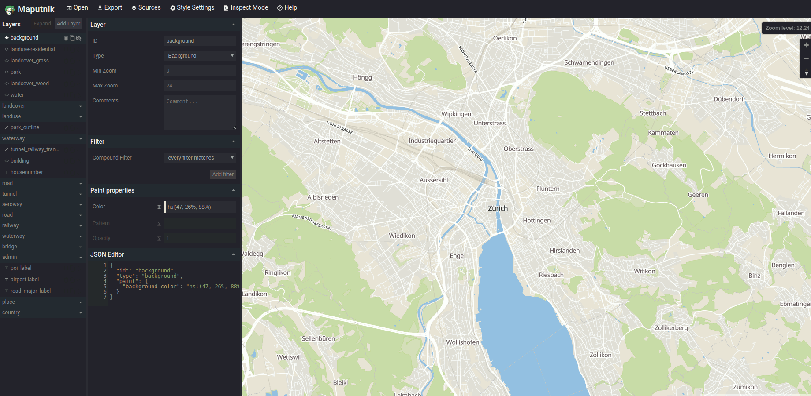
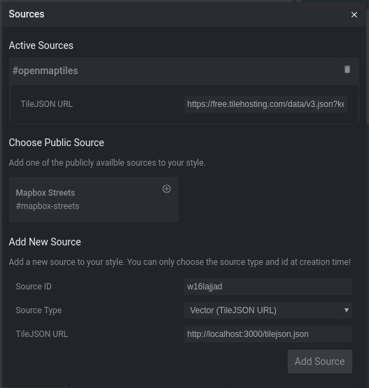
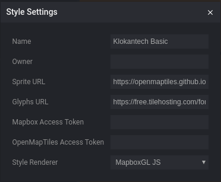
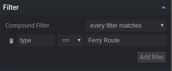

# Cómo simbolizar teselas vectoriales

## Maputnik

Es un editor visual gratuito y abierto para estilos Mapbox GL dirigidos tanto a desarrolladores como a diseñadores de mapas.

Se puede utilizar en línea en [*Maputnik editor*](https://maputnik.github.io/editor/) (todo se guarda en el almacenamiento local) ó se puede hacer una instalación local.

### Instalación 

Si vamos a la página de [*Releases*](https://github.com/maputnik/editor/releases) de Maputnik aparece que la última versión es la v1.0.2. Realmente existe una versión v1.1.0 que está en la página de releases pero que no está marcada como la última versión.

Descagaremos la versión v1.1.0 que es la última versión disponible para la fecha de este taller. 

```
wget https://github.com/maputnik/editor/archive/v1.1.0.tar.gz
tar -xzvf archivo.tar.gz
```

Vamos a la carpeta *editor-1.1.0* creada al descomprimir el archivo descargado he instalamos las dependencias del Maputnik

```
cd editor-1.1.0
npm install
```

Al finalizar la instalación comprobamos que no aparezca ningún error (pueden aparecer algunos WARN) y arrancamos el servidor de Maputnik

```
npm start
```

Abrir el navegador y escribir http://localhost:8888 y comprobar que aparece la página del Maputnik


*Maputnik*

## Estilizar el mbtiles

Por defecto Maputnik nos

### Agregar un origen de datos (Source)

En el editor del Maputnik en la barra de menú seleccionamos la opción de **Source** para desplegar el diálogo de gestionar fuentes de datos. En la parte inferior del diálogo esta el apartado para agregar una fuente nueva de datos *Add New Source*. Para agregar nuestra fuente de datos mbtiles tenemos dos opciones.



*Maputnik agregar origen de datos*

1. Vector (TileJSON URL)

*Source ID*: identificador único de la capa: es el nombre que utilizaremos como referencia en las capas. En nuestro caso pondremos *natural_earth*

*Source Type*: tipo de la fuente de datos. Seleccionar la opción de *Vector (TileJSON URL)*

*TileJSON URL*: url del archivo JSON de descripción de la fuente. Pondremos la url de nuestro TileServerGL http://localhost:8181/data/natural_earth.json


2. Vector (XYZ URL)

*Source ID*: identificador único de la capa: es el nombre que utilizaremos como referencia en las capas. En nuestro caso pondremos *natural_earth_1*

*Source Type*: tipo de la fuente de datos. Seleccionar la opción de *Vector (XYZ URL)*

*TileJSON URL*: url del servicio de teselas. Pondremos la url de nuestro TileServerGL http://localhost:8181/data/natural_earth/{z}/{x}/{y}.pbf

*Min Zoom*: 0

*Max Zoom*: 5

### Agregar sprite y glyph

En el editor de Maputnik en la barra de menú seleccionamos la opción de **Style Settings** para desplegar el diálogo de gestionar la configuración del estilo.



*Maputnik configuración de estilo*

*Name*: nombre del estilo. En nuestro caso pondremos **natural earth**

*Sprite URL*: proporciona una plantilla para cargar imágenes pequeñas para usar en la representación de estilo del fondo, patrones de relleno, patrones de líneas e imagenes de iconos. En nuestro caso pondremos "https://openmaptiles.github.io/osm-bright-gl-style/sprite"

*Glyphs URL*: proporciona una plantilla para cargar conjuntos de glifos formato PBF. Aquí es donde se cargan las diferentes fuentes. En nuestro caso pondremos "https://free.tilehosting.com/fonts/{fontstack}/{range}.pbf?key=RiS4gsgZPZqeeMlIyxFo"

### Agregar una capa

En el editor de Maputnik presionamos el botón de **Add Layer** para desplegar el diálogo de agregar capa al mapa. 


*Maputnik agregar capa*

*ID*: identificador único de la capa. Pondremos *oceanos*

*Type*: tipo de capa. Seleccionar la opción de *Fill* ya que la capa es de tipo polígono

*Source*: identificador del origen de datos. En nuestro caso pondremos *natural_earth*

*Source Layer*: identificador de la capa dentro del origen de datos. Pondremos *ocean* para agregar la capa de los océanos.

### Estilizar una capa según un campo

En esta versión de maputnik (v1.1.0) no está implemantado el estilo [basado en expressiones](https://www.mapbox.com/mapbox-gl-js/style-spec/#expressions). Se pueden utilizar los [stops](https://blog.mapbox.com/introducing-data-driven-styling-in-mapbox-gl-js-f273121143c3) que actualmente estan *deprecated* para aplicar estilos según el nivel de zoom. En nuestro caso tendremos que utilizar filtros para poder estilizar una capa según un valor de un campo de texto.

1. Agregar la capa de lineas de Ferry. Presionar el botón de **Add Layer** y rellenar el formulario con la siguiente información:

    *ID*: *ferrys*

    *Type*: *Line* ya que la capa es de tipo línea

    *Source*: *natural_earth*

    *Source Layer*: *roads* para agregar la capa de carreteras que también contiena las lineas de ferry.

2. Vemos que aparecen todas las carreteras en el mapa.

3. Filtar la información. Selección la capa de *ferrys* y en el apartado de Filter presionar el botón de **Add filter**. En registro que aparece poner la siguiente información:  



*Maputnik agregar filtro a una capa*

    * Cambiar donde dice name por *type*

    * Dejar el selector de comparación en *==*

    * Escribir en el campo de valor (que está vacio) *Ferry Route*

Comprobar que sólo aparacen las líneas de Ferry en el mapa.

!!! question
    Hacer lo mismo para agregar la capa de carreteras principales(Major Highway) y secundarias(Secondary Highway).

### Etiquetar una capa

1. Agregar la capa de ciudades. Presionar el botón de **Add Layer** y rellenar el formulario con la siguiente información:

    *ID*: *ciudades*

    *Type*: *Symbol* ya que queremos que sea de tipo texto

    *Source*: *natural_earth*

    *Source Layer*: *cities* para agregar la capa de ciudades.

2. Agregar el campo por el que se quiere etiquetar. Seleccionar la capa de *ciudades* y en el apartado de **Text layout properties** en el campo *Field* escribir **{nombre del campo}**. En nuestro caso debemos escribir *{NAME}*.

3. Estilizar las etiquetas. En el apartado de **Text paint properties** podemos definir el estilo de las etiquetas. Para los textos podemos definir un Halo para que el teto destaque mejor en nuestro mapa.


### Utilizar un icono para simbolizar nuestra capa

1. Agregar la capa de aeropuertos. Presionar el botón de **Add Layer** y rellenar el formulario con la siguiente información:

    *ID*: *aeropuertos*

    *Type*: *Symbol* ya que queremos que sea de tipo texto

    *Source*: *natural_earth*

    *Source Layer*: *airports* para agregar la capa de aeropuertos.

2. Agregar el icono. Selecccionar la capa de *aeropuertos* y en el apartado de **Icon layout properties** escribir en el campo *Image* **airport_11**. Este nombre debe coincidir con alguna imagen definida en el sprite.

3. Comprobar que aparecen los aeropuertos en el mapa

!!! tip
    Aqui puede ver la lista de los nombres de las imágenes del sprite que estamos utilizando https://github.com/openmaptiles/osm-bright-gl-style/tree/master/icons.
 

 ## Ejercicio

 Agregar y aplicar estilo al resto de capas del **natural_earth.mbtiles** 
