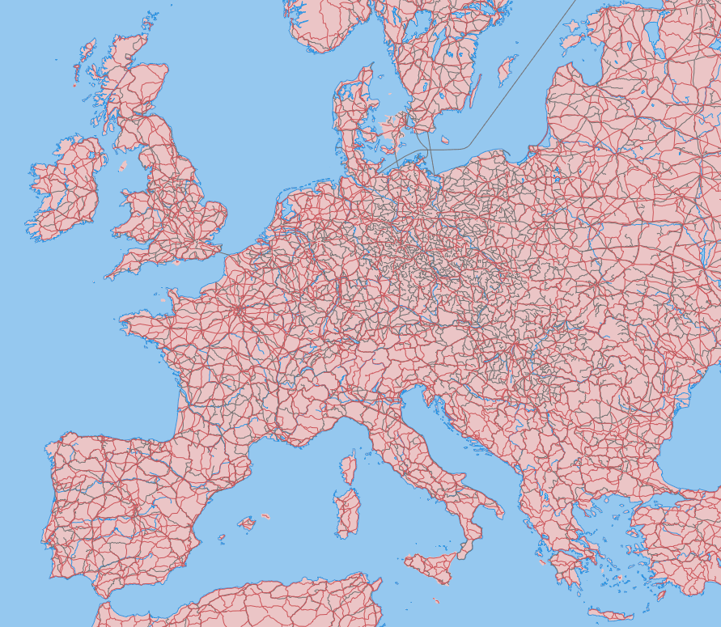
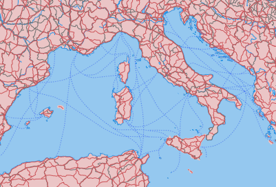

# Cómo simbolizar teselas vectoriales


## Maputnik

Es un editor visual gratuito y abierto para estilos Mapbox GL dirigidos tanto a desarrolladores
como a diseñadores de mapas.

Se puede utilizar en línea en [*Maputnik editor*](https://maputnik.github.io/editor/) o se puede
hacer una instalación local.


### Instalación

Se puede descargar la última versión de la [*página de releases*](https://github.com/maputnik/editor/releases).
En nuestro caso, la tenemos ya descargada en `~/Desktop/taller-vt/maputnik`.

Para arrancar la versión local:

```bash
cd ~/Desktop/taller-vt/maputnik
live-server --port=8082
```

Abrir Maputnik en http://localhost:8082


### Comenzar un estilo nuevo 

En la barra de menú seleccionamos la opción **Open**.
Del apartado **Gallery Styles**, seleccionamos **Empty Style**.


### Agregar un origen de datos (Source)

En la barra de menú seleccionamos la opción **Source**.
En la parte inferior del diálogo está la sección: **Add New Source**.


* Como `Source ID` ponemos `naturalearth`.
* Como `Source Type` seleccionamos `Vector (TileJSON URL)`.
* Como `TileJSON URL` seleccionamos `http://localhost:8081/data/natural_earth.json`

También se podría usar como `Source Type` un `Vector (XYZ URL)`, en cuyo caso también hay que
indicar el rango de zooms en que los datos son válidos.


### Agregar sprite y glyphs

En la barra de menú seleccionamos **Style Settings**:


* `Name`: Nombre del estilo. En nuestro caso pondremos `Natural Earth`.
* `Sprite URL`: Usaremos el sprite de uno de los estilos que tenemos publicados en tileserver `http://localhost:8081/styles/osm-bright/sprite`
* `Glyphs URL`: Accederemos a las tipografías publicadas en nuestro Tileserver `http://localhost:8081/fonts/{fontstack}/{range}.pbf`


### Simbolización básica

Presionamos el botón de **Add Layer**: 


#### Fondo

Añadimos una primera capa de fondo:

* `ID`: identificador único de la capa. Pondremos `fondo`.
* `Type`: tipo de capa. Seleccionar la opción de `Background`.

Seleccionamos el color en **Paint properties** => **Color**: "#50A8E7".

El fondo del mapa pasa a un gris claro.

#### Océanos

Añadimos ahora los océanos: 

* `ID`: identificador único de la capa. Pondremos `oceanos`.
* `Type`: tipo de capa. Seleccionar la opción de `Fill` ya que la capa es de tipo polígono.
* `Source`: identificador del origen de datos. En nuestro caso pondremos `naturalearth`.
* `Source Layer`: identificador de la capa dentro del origen de datos. Pondremos `ocean`.

Aparecerán los océanos de color negro.

Simbolizamos la capa seleccionando un color RGB en **Paint properties** => **Color**: "#50A8E7".

En el apartado inferior del panel de propiedades de la capa, vamos viendo la definición tal
como se guardará en el fichero json de estilo:

```json
{
  "id": "oceanos",
  "type": "fill",
  "source": "naturalearth",
  "source-layer": "ocean",
  "paint": {
    "fill-color": "#50A8E7"
  }
}
``` 

Maputnik no es más que un asistente gráfico para generar el fichero `style.json`. 

#### Resto de capas básicas

El resto de capas se puede simbolizar procediendo de la misma manera: 

| id | type | source-layer | color | otras propiedades "paint" |
|----|------|--------------|-------|-------------------|
| fondo | Background | -- | #F8F4F0 | -- |
| oceanos | Fill | ocean | #A0C8F0 | -- |
| tierra | Fill | land | #E6C7C7 | -- |
| costa | Line | coastline | #4793E8 | -- |
| rios | Line | rivers | #4793E8 | -- |
| lagos | Fill | lakes | #A0C8F0 | "stroke-color": "#4793E8" |
| ferrocarril | Line | rail | #707070 | -- | 
| carreteras | Line | roads | #BF5757 | -- |



### Filtrar los datos a mostrar en una capa

Vamos a eliminar las rutas de ferry que se muestran como carreteras.

Hay dos maneras de definir un filtro en un estilo MapboxGL:
1. **Filters**: La forma clásica, que implementa Maputnik: https://www.mapbox.com/mapbox-gl-js/style-spec/#other-filter
2. **Decision Expressions**: La nueva forma, más potente, pero que Maputnik no implementa: https://www.mapbox.com/mapbox-gl-js/style-spec/#expressions-decision

En Maputnik, seleccionando la capa `carreteras`, apartado **Filter**: Presionamos el botón **Add filter**.
La condición será:

        featurecla == Road


Comprobar que desaparecen las líneas de Ferry en el mapa.

!!! tip
    Usa el **Inspect Mode** integrado en Maputnik para explorar los diferentes campos de una capa y sus posibles valores.

#### Ejercicio extra

Crea una nueva capa "ferrys" y aplica el filtro contrario para mostrar sólo las rutas de ferry.
Investiga la propiedad `Dasharray` para darle un aspecto de línea discontinua a las rutas.




### Etiquetar una capa

1. Agregar la capa de ciudades. Presionar el botón de **Add Layer** y rellenar el formulario con
la siguiente información:

    * `ID`: `ciudades`
    * `Type`: `Symbol`, utilizado para mostrar entidades puntuales (iconos y etiquetas)
    * `Source`: `naturalearth`
    * `Source Layer`: `cities`

2. En el apartado **Text layout properties**:

    * En la propiedad `Field` escribir `{NAME}` (el nombre del campo a mostrar, entre llaves).
    * En la propiedad `Font`, escribir `Comic Sans`, tipografía que hemos generado y publicado en el apartado anterior (nota: el taller sobre cómo evitar hacer mapas feos es esta tarde).

3. Estilizar las etiquetas. En el apartado de **Text paint properties**:
 Para los textos podemos definir un Halo para que el teto destaque mejor en nuestro mapa.


### Utilizar un icono para simbolizar nuestra capa

1. Agregar la capa de aeropuertos. Presionar el botón de **Add Layer** y rellenar el formulario con
la siguiente información:

    * `ID`: `aeropuertos`
    * `Type`: `Symbol`, utilizado para mostrar entidades puntuales (iconos y etiquetas)
    * `Source`: `naturalearth`
    * `Source Layer`: `airports`

2. En el apartado de **Icon layout properties**:

    * En la propiedad `Image`, escribir `airport_11`. Este nombre debe coincidir con alguna imagen definida en el sprite.

3. Comprobar que aparecen los aeropuertos en el mapa.

!!! tip
    Estos son los iconos del sprite del estilo (`osm-bright`) que estamos utilizando:
    https://github.com/openmaptiles/osm-bright-gl-style/tree/master/icons


### Exportar el estilo creado

Seleccionar la opción **Export**, y luego el boton de **Download** para descargar el estilo en nuestro ordenador.
Descargamos el archivo, lo renombramos a `style.json` y lo movemos a la carpeta `tileserver/styles/natural-earth/`,
donde ya habíamos copiado los sprites generados en el apartado anterior.

Habrá que editar el fichero de configuración de tileserver `tileserver/config.json` para añadir el estilo: 


```json
{
  "styles": {
    "natural-earth": {
      "style": "natural-earth/style.json"
    }
  }
}
```

Reiniciar tileserver y comprobar que ofrece el nuevo estilo de visualización.


## Edición manual del estilo

Vamos a dejar Maputnik a un lado y vamos a editar el estilo json a mano.
 

### Crear un visor para el nuevo estilo

Lo primero será crear un visor para los datos y estilo de Natural Earth partiendo del visor de Barcelona.
También usaremos una copia local del estilo porque será más fácil ir viendo los cambios. Cada vez que guardemos en disco una
modificación del fichero de estilo, podremos recargar directamente la página en el navegador para reflejar los cambios.

* Copiar el archivo `visor/barcelona.html` en `visor/naturalearth.html`
* Además, hacer una copia de `tileserver/styles/natural-earth/style.json` en `visor/natural-earth-style.json`.

Editaremos `visor/naturalearth.html` y en la parte de `<script>` dejaremos sólo este código:

```javascript
var map = new mapboxgl.Map({
    container: 'map',
    style: 'natural-earth-style.json',
    center: [1.5, 41],
    zoom: 5,
    hash: true
});

map.addControl(new mapboxgl.NavigationControl());
map.addControl(new MapboxInspect());
```  

Abriendo en el navegador http://127.0.0.1:8080/naturalearth.html debería verse:


### Estilo avanzado basado en expresiones

El estilo basado en datos permite estilizar los datos en función del valor de sus propiedades.
Por ejemplo, cambiar el radio de un círculo o el color de un polígono en función de un valor
numérico, o usar lógica condicional para crear etiquetas multilingües.

Las [expresiones de Mapbox GL](https://www.mapbox.com/mapbox-gl-js/style-spec#expressions) se
pueden usar en cualquier propiedad de tipo `layout`, `paint` o `filter` de una `layer`.

Gracias a las expresiones, una regla de simbolización determinada puede calcularse como el resultado de
un cálculo donde intervienen los valores de una o más propiedades de una *feature*. Pueden
usarse operaciones lógicas, matemáticas, de generación de color, interpolaciones, etc.


#### Estilo basado en valores concretos de una propiedad

Abrir el fichero `natural-earth-style.json` y localizar el layer con id `carreteras`.

Vamos a asignar un color distinto en función del valor de la propiedad `type`.
Para ello usaremos la expresión [Match](https://www.mapbox.com/mapbox-gl-js/style-spec#expressions-match),
que asigna a cada valor de entrada un valor de salida distinto (en nuestro caso, un color para
cada tipo de carretera):

    ["match", <propiedad>,
        <valorentrada_1>, <salida_1>,
        <entrada_2>, <salida_2>,
        ...,
        <salida_por_defecto>
    ]

Para obtener el valor de la propiedad de una feature se usa la expresión Get: `["get", <nombre_propiedad>]`.

```json hl_lines="9 10 11 12 13"
{
    "id": "carreteras",
    "type": "line",
    "source": "naturalearth",
    "source-layer": "roads",
    "filter": ["all", ["==", "featurecla", "Road"]],
    "paint": {
        "line-color": [
            "match", ["get", "type"],
            "Major Highway",     "rgba(20, 52, 232, 1)",
            "Secondary Highway", "rgba(206, 32, 79, 1)",
            "Road",              "rgba(49, 137, 52, 1)",
            "rgba(255, 204, 0, 1)"
        ],
        "line-width": 2
    }
}
```

#### Estilo basado en el nivel del zoom

Localizar el layer con id `ciudades`.

Vamos a cambiar el tamaño del texto según el nivel de zoom del mapa, y de la propiedad `SCALERANK` del dato.

Usaremos la expresión [Case](https://www.mapbox.com/mapbox-gl-js/style-spec#expressions-case), que tiene
esta forma:

    ["case",
        <condicion_1>, <salida_1>,
        <condicion_2>, <salida_2>,
        ...,
        <salida_por_defecto>
    ]

En nuestro caso la usaremos para decir cosas como:

* Si "SCALERANK" es menor que 2, aplica un tamaño de letra 20,
* Si "SCALERANK" está entre 3 y 5, aplica un tamaño de letra 14,
* En cualquier otro caso, aplica un tamaño de letra 10

Que quedaría expresado así:

```json
[
  "case",
  ["<=", ["number",["get", "SCALERANK"]], 2], 20,
  ["<=", ["number",["get", "SCALERANK"]], 5], 14,
  10
]
```

El operador `"number"` se usa para convertir el valor `SCALERANK` a un tipo numérico.

Y la combinaremos con la expresión [Step](https://www.mapbox.com/mapbox-gl-js/style-spec#expressions-step), que tiene
esta forma:

    ["step",
        <entrada>, <salida_inicial>,
        <umbral_1>, <salida_1>,
        <umbral_2>, <salida_2>,
        ...
    ]
    
En nuestro caso la podemos usar para decir cosas como:

* Usa un tamaño de letra 18 para zooms por debajo de 5.
* Usa un tamaño de letra 20 entre el zoom 5 y 8.
* Usa un tamaño de letra 24 para zooms mayores que 8.

Que quedaría:

```json
["step",
    ["zoom"], 18,
    5, 20,
    8, 24
]
```

Obviamente podemos combinar ambas expresiones, de forma que la salida para cada nivel de zoom no sea un tamaño de
 letra concreto, sino que dependa de "SCALERANK". Y nos queda el siguiente monstruo para el Layer:

```json
{
    "id": "ciudades",
    "type": "symbol",
    "source": "naturalearth",
    "source-layer": "cities",
    "layout": {
        "text-field": "{NAME}",
        "text-anchor": "bottom",
        "text-offset": [0, -1],
        "text-size": [
            "step", ["zoom"],
            [
              "case",
              ["<", ["number", ["get", "SCALERANK"]], 3], 18,
              0
            ],
            5, ["case",
                  ["<=", ["number",["get", "SCALERANK"]], 2], 20,
                  ["<=", ["number",["get", "SCALERANK"]], 5], 14,
                  10
               ],
            8, ["case",
                  ["<=", ["number",["get", "SCALERANK"]], 2], 24,
                  ["<=", ["number",["get", "SCALERANK"]], 5], 18,
                  14
               ]
        ]
    },
    "paint": {
        "text-halo-color": "rgba(253, 253, 253, 1)",
        "text-color": "rgba(16, 16, 16, 1)",
        "text-halo-width": 1.5
    }
}
```

Como se puede observar, las expresiones son tan potentes como difíciles de escribir bien a la primera.


#### Estilo basado en una propiedad

Vamos a crear un nuevo `layer` llamado `ciudades-circle`, y la vamos a definir a continuación de `ciudades`
y justo antes de `aeropuertos`. Dibujaremos un círculo cuyo tamaño será inversamente proporcional a la
propiedad `SCALERANK`.

Además, las capitales estatales se simbolizarán como un círculo blanco con un borde grueso, y el resto de
ciudades con un círculo gris con borde más fino.

Usaremos la misma expresión Match que hemos visto anteriormente, aplicada a un color y a un grueso de línea.

Además, aplicaremos una expresión matemática `["-"]`, que resta dos valores, de manera que el tamaño del círculo
será `10 - SCALERANK`: 

```json
{
    "id": "ciudades-circle",
    "type": "circle",
    "source": "naturalearth",
    "source-layer": "cities",
    "paint": {
        "circle-color": [
            "match", ["get", "ADM0CAP"],
            0, "#888",
            "#FFF"
        ],
        "circle-stroke-width": [
            "match", ["get", "ADM0CAP"],
            0, 1,
            2
        ],
        "circle-radius": ["-", 10, ["get", "SCALERANK"]]
    }
}
```

## Uso de fuentes de datos externas

Por último, vamos a añadir un fondo raster al mapa, procedente de otro tileserver.

* Añadiremos un nuevo `source` de tipo `raster`, a continuación del source `naturalearth`:

```json
{
    ...
    "relief": {
        "type": "raster",
        "tiles": ["http://naturalearthtiles.lukasmartinelli.ch/tiles/natural_earth_2_shaded_relief.raster/{z}/{x}/{y}.png"],
        "tileSize": 256,
        "maxzoom": 6
    }
}
```

* Borraremos el `layer` llamado `tierra`.
* Añadiremos un nuevo `layer` justo después del `fondo` que se llamará `terreno`:

```json
{
  "id": "terreno",
  "type": "raster",
  "source": "relief"
}
```

El resultado final de aplicar todos estos estilos tendrá este aspecto:


### Ejercicio extra: uso de una fuente con iconos para simbolizar un punto

Si se ha hecho el ejercicio extra del apartado anterior, en el que creábamos una fuente
a partir de una colección de iconos, ahora veremos cómo utilizarla en el Layer de
aeropuertos:


```json hl_lines="8 9 10 11"
{
  "id": "aeropuertos",
  "type": "symbol",
  "source": "naturalearth",
  "source-layer": "airports",
  "layout": {
    "symbol-placement": "point",
    "icon-image": "",
    "text-font": ["Geostart Regular"],
    "text-size": 25,
    "text-field": ","
  },
  "paint": {
    "text-color": "#fabada",
    "text-halo-color": "#888",
    "text-halo-width": 2
  }
}
```

En las líneas destacadas se observa cómo no se usa una `icon-image`, sino una etiqueta de texto (`text-font`, `text-size`
y `text-field`). En `text-field` se indica una coma `","`, que corresponde al icono que queremos mostrar.
Al tratarse de una fuente, podemos indicar el tamaño que queramos sin miedo a obtener una imagen pixelada,
y aplicar otras propiedades como escoger color, halo, etc.

Como resultado del estilo indicado se simbolizarían los aeropuertos así:


