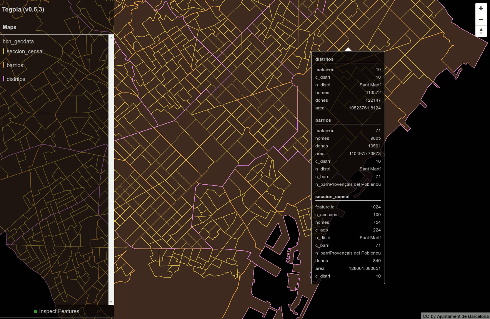
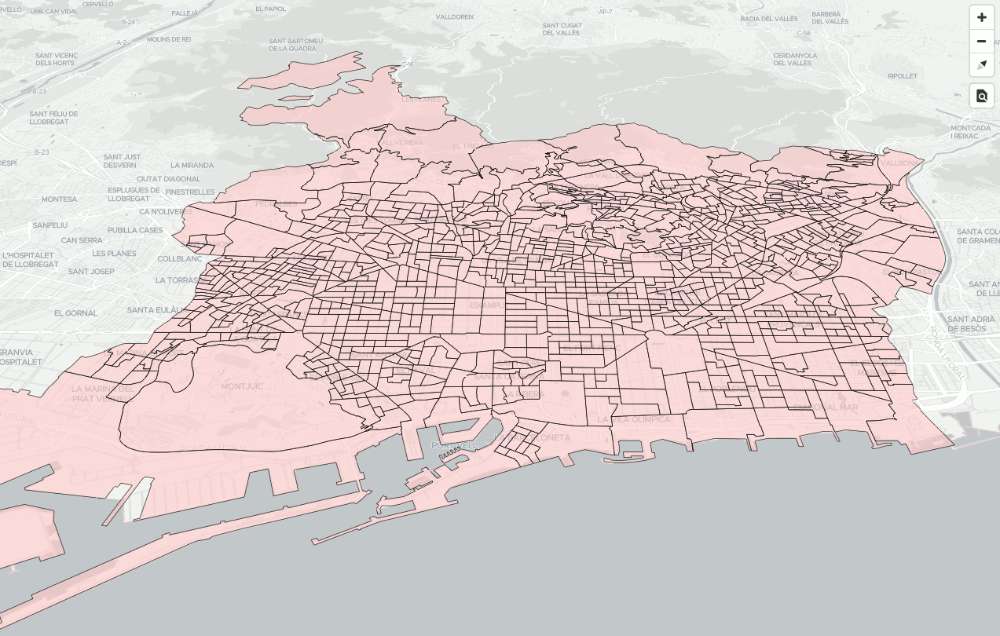
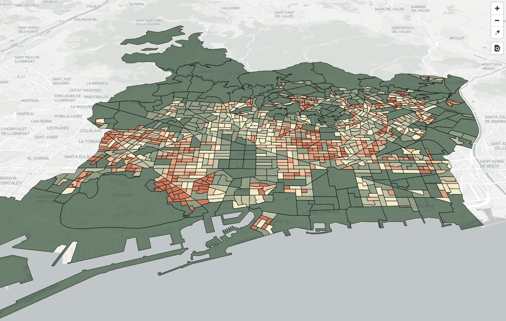
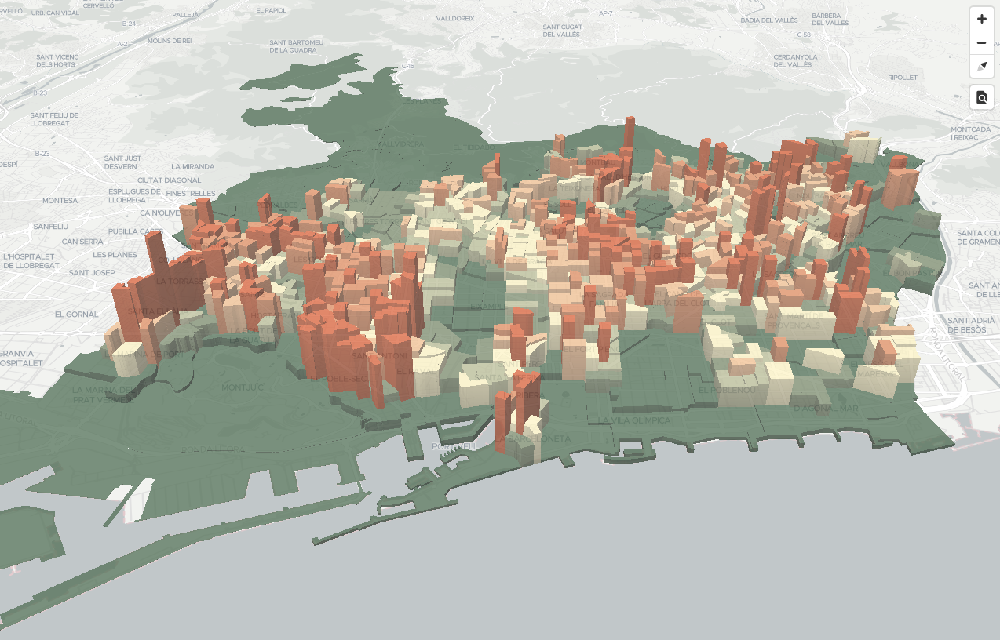

# Cómo servir datos dinámicos

Partiremos de unos datos con los distritos, barrios y secciones censales de Barcelona.
Los datos están en `datos/bcn_geodata.sql`.

!!! note
    El origen de los datos es Ajuntament de Barcelona CC-by (http://w20.bcn.cat/cartobcn/).
    Martín González los convirtió a GeoJSON (https://github.com/martgnz/bcn-geodata).
    Para el taller los hemos convertido de GeoJSON a PostGIS.

Cargarlos en PostGIS:

```bash
cd ~/Desktop/taller-vt
psql < datos/bcn_geodata.sql
```

Se creará una BDD `bcn_geodata` con las tablas `barrios`, `distritos` y `seccion_censal`.
Se puede acceder a esta BDD con el usuario `user`, password `user`.

Una vez con los datos cargados en PostGIS, usaremos [`tegola`](http://tegola.io/) para levantar un servidor de teselas
vectoriales partir de una BDD PostGIS.

## Instalando Tegola

Tegola consiste en un solo fichero ejecutable. La instalación consiste en descargarse un zip, descomprimirlo, y copiar
el fichero ejecutable resultante en una ruta localizable:

```bash
wget https://github.com/go-spatial/tegola/releases/download/v0.6.3/tegola_linux_amd64.zip
unzip tegola_linux_amd64.zip
sudo mv tegola_linux_amd64 /usr/local/bin/tegola
```

Comprobar que puede ejecutarse tegola correctamente, y borrar el zip:

```bash
tegola -h # comprobar instalacion
rm tegola_linux_amd64.zip
```


## Configurando Tegola

Tegola necesita de un [fichero de configuración en formato toml](http://tegola.io/documentation/configuration) para funcionar.
En él estableceremos los parámetros de conexión con la BDD y las características de las capas que queremos servir.

Creemos pues un directorio llamado `tegola`, y en él, un fichero llamado `config.toml`.

```bash
mkdir tegola
cd tegola
touch config.toml
```

Lo primero es definir una sección con el puerto que usaremos para levantar el servicio: 

```toml
[webserver]
port = ":8083"
```

A continuación definimos la conexión con la BDD en una sección `providers`. Dentro del provider, definimos las capas de
datos que queremos obtener de la BDD. En nuestro caso son muy sencillas:

```toml
[[providers]]
name = "postgis"
type = "postgis"
host = "localhost"
port = 5432
database = "bcn_geodata"
user = "user"
password = "user"

    [[providers.layers]]
    name = "distritos"
    tablename = "distritos"
    
    [[providers.layers]]
    name = "barrios"
    tablename = "barrios"
    
    [[providers.layers]]
    name = "seccion_censal"
    tablename = "seccion_censal"
```

En estas `providers.layers` también se podrían seleccionar qué columnas queremos obtener, o incluso indicar una consulta SQL para
generar la capa, haciendo JOIN de varias tablas, aplicando operaciones espaciales, etc. En nuestro caso, servimos las
tablas tal cual.

Finalmente, creamos una sección `maps`, que consiste en un nombre, y una serie de capas de información:

```toml
[[maps]]
name = "bcn_geodata"
attribution	= "CC-by Ajuntament de Barcelona"
center = [2.175, 41.39, 13.0]
bounds = [1.898, 41.246, 2.312, 41.533]

    [[maps.layers]]
    provider_layer = "postgis.seccion_censal"
    dont_simplify = true
    min_zoom = 11
    max_zoom = 16

    [[maps.layers]]
    provider_layer = "postgis.barrios"
    dont_simplify = true
    min_zoom = 10
    max_zoom = 16

    [[maps.layers]]
    provider_layer = "postgis.distritos"
    dont_simplify = true
    min_zoom = 0
    max_zoom = 16
```

En estas `maps.layers` se indican parámetros para la generación de las VT, como el rango de niveles de zoom en las que
serán visibles, si se simplificará o no la geometría.

En la configuración también existe la posibilidad de activar una caché en disco, en s3 o en redis, así como comandos para
invalidar partes de la caché. En nuestro caso, no hemos usado caché.


## Arrancando tegola

Arrancamos el servicio desde el directorio donde hayamos guardato `config.toml`:

```bash
cd tegola
tegola serve
```

Y abrimos http://localhost:8083 :



Activando "Inspect Features" podremos ver los atributos de cada elemento.

Las teselas están disponibles en: http://localhost:8083/maps/bcn_geodata/{z}/{x}/{y}.pbf


## Incorporando los datos en el visor de Barcelona

Añadiremos el siguiente código javascript a `barcelona.html` para incorporar el nuevo origen de datos, y una simbolización básica para mostrar las secciones censales:

```javascript
    map.on('load', function() {
        map.addSource('bcn_geodata', {
            "type": "vector",
            "tiles": ["http://localhost:8083/maps/bcn_geodata/{z}/{x}/{y}.pbf"]
        });

        map.addLayer({
            "id": "seccion_censal",
            "source": "bcn_geodata",
            "source-layer": "seccion_censal",
            "type": "fill",
            "paint": {
                "fill-opacity": 0.6,
                "fill-color": "#fcc",
                "fill-outline-color": "#000"
            }
        });
    });
```




### Temático avanzado

#### Expresiones matemáticas

En las tablas tenemos los campos de población divididos en hombres (`homes`) y mujeres (`dones`), así como el área en
m² de cada sección. Con estos datos, podemos calcular la densidad de población en habitantes/km² según la fórmula:

    densidad = (homes+dones)/(area/1000000)

El estilo de mapbox-gl permite expresar [operaciones matemáticas usando expresiones](https://www.mapbox.com/mapbox-gl-js/style-spec#expressions-math),
de la forma:

* `["+", ["get", "homes"], ["get", "dones"]]` para sumar la población de hombres y de mujeres
* `["/", ["get", "area"], 1000000]` para pasar el área de m² a km²

Y, combinando ambas, obtenemos la densidad de población en habitantes/km²:

```json
["/",
    ["+", ["get", "homes"], ["get", "dones"]],
    ["/", ["get", "area"], 1000000]
]
```

#### Rampas de color

Así mismo, las expresiones de los estilos de mapbox-gl nos permiten [aplicar un número discreto de valores de salida a
rangos de entrada](https://www.mapbox.com/mapbox-gl-js/style-spec#expressions-step).
Las definiciones del manual sin un ejemplo concreto son algo difíciles de leer:

```json
["step",
    input: number,
    stop_output_0: OutputType,
    stop_input_1: number, stop_output_1: OutputType,
    stop_input_n: number, stop_output_n: OutputType, ...
]: OutputType  
```

Pero supongamos que queremos aplicar esta expresión para asignar tres colores en función de rangos de densidad (`< 10.000 hab/km²`,
`de 10.000 a 25.000 hab/km²`, y `> 25.000 hab/km²`), la expresión sería:

```json
["step",
    ["get", "densidad"],
    "<Color_1>",
    10000, "<Color_2>",
    25000, "<Color_3>"
]
```

Más sencillo de lo que parecía.


#### Combinando ambas expresiones

Podemos combinar ambas expresiones: "calcula la densidad y luego asigna un color en función de su valor"

```json
["step",
    ["/",
        ["+", ["get", "homes"], ["get", "dones"]],
        ["/", ["get", "area"], 1000000]
    ],
    "#3d5941",
    17703, "#778868",
    29678, "#b5b991",
    37617, "#f6edbd",
    46016, "#edbb8a",
    54401, "#de8a5a",
    66570, "#ca562c"
]
```

!!! tip
    Los valores de corte para los diferentes colore se han obtenido calculando los cuantiles con PostgreSQL:
    
    ```postgresql
    SELECT
    ntile,
    CAST(min(densitat) AS INTEGER)  AS minAmount,
    CAST(max(densitat) AS INTEGER)  AS maxAmount
    FROM (SELECT (homes+dones)/(area/1000000) as densitat, ntile(7) OVER (ORDER BY (homes+dones)/(area/1000000)) AS ntile FROM seccion_censal) x
    GROUP BY ntile
    ORDER BY ntile;
    ```
    
    Y la rampa de color y sus valores RGB de cada color se han obtenido de [carto-colors](https://carto.com/carto-colors/),
    que a su vez están inspirados en ColorBrewer. 
 
Aplicada a la propiedad `fill-color` del estilo:

```javascript
    map.addLayer({
        "id": "seccion_censal",
        "source": "bcn_geodata",
        "source-layer": "seccion_censal",
        "type": "fill",
        "paint": {
            "fill-opacity": 0.75,
            "fill-color": ["step",
                ["/",
                    ["+", ["get", "homes"], ["get", "dones"]],
                    ["/", ["get", "area"], 1000000]
                ],
                "#3d5941",
                17703, "#778868",
                29678, "#b5b991",
                37617, "#f6edbd",
                46016, "#edbb8a",
                54401, "#de8a5a",
                66570, "#ca562c"
            ],
            "fill-outline-color": "#000"
        }
    });
```

Obtendremos:




## Ejercicio extra: Añadir extrusión 3D

Aplicar una extrusión a cada sección censal de altura proporcional a su densidad de población:



<!---
map.addLayer({
    "id": "densidad",
    "source": "bcn_geodata",
    "source-layer": "seccion_censal",
    "type": "fill-extrusion",
    "paint": {
        "fill-extrusion-opacity": 0.75,
        "fill-extrusion-color": ["step",
            ["/",
                ["+", ["get", "homes"], ["get", "dones"]],
                ["/", ["get", "area"], 1000000]
            ],
            "#3d5941",
            17703, "#778868",
            29678, "#b5b991",
            37617, "#f6edbd",
            46016, "#edbb8a",
            54401, "#de8a5a",
            66570, "#ca562c"
        ],
        "fill-extrusion-height": ["/",
            ["+", ["get", "homes"], ["get", "dones"]],
            ["/", ["get", "area"], 10000]
        ],
    }
});
-->
