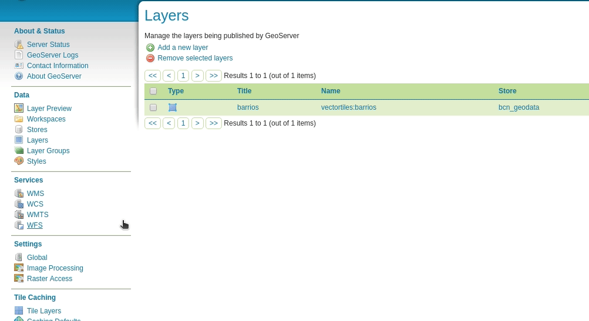
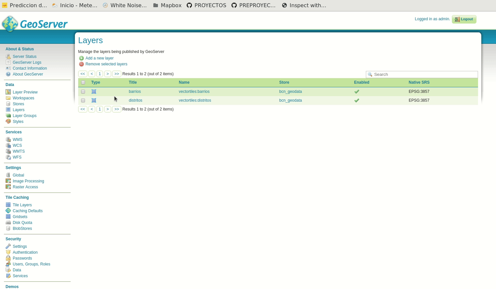
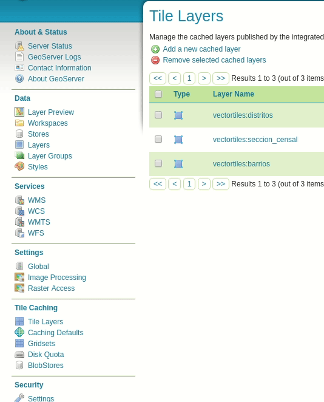
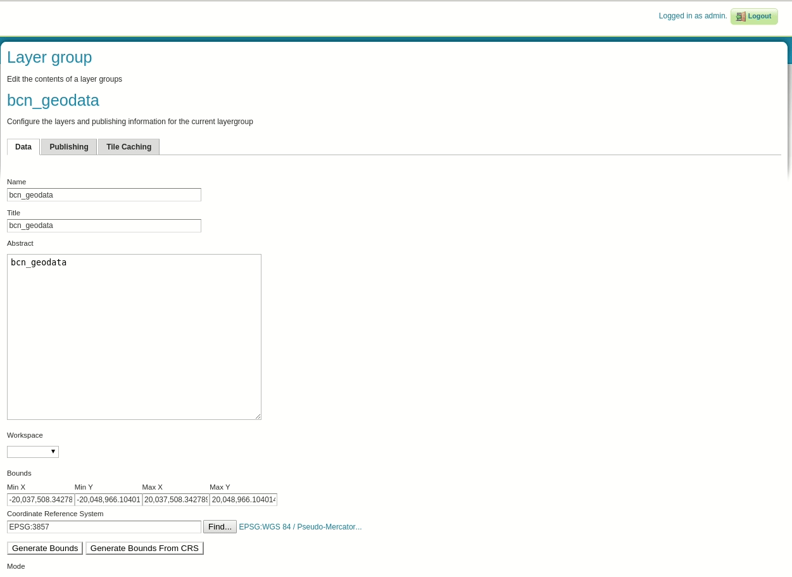

# Servir vector tiles desde GeoServer

GeoServer está preparado para servir teselas vectoriales en tres formatos diferentes: GeoJSON TopoJSON y las vector tiles de Mapbox. 

| Formato | MIME | Descripción |
| -- | -- | -- |
| Mapbox Vector (MVT) | `application/vnd.mapbox-vector-tile` | **Formato Recomendado** |
| GeoJSON | `application/json;type=geojson` | No soportado por muchos de los clientes de Vector Tiles |
| TopoJSON | `application/json;type=topojson` | Más complejo que el GeoJSON por gestionar la topología. No está soportado por muchos clientes |

GeoServer soporta Vector Tiles a través de GeoWebCache, por lo que será este el que se encargue de gestionar las capas que serán consumidas en este formato. 

Lo primero para poder usar Vector Tiles con GeoServer será instalar la librería que le da soporte.

## Instalar la extensión de Vector Tiles en GeoServer

Para instalar la extensión de GeoServer que nos permita usar vector tiles lo primero que haremos será descargar la librería de la versión de geoserver que estemos utilizando (para este ejemplo es la versión 2.14.4):

```bash
wget http://sourceforge.net/projects/geoserver/files/GeoServer/2.14.4/extensions/geoserver-2.14.4-vectortiles-plugin.zip
```

Extraeremos el contenido del archivo en la carpeta `WEB-INF-lib` de nuestra instalación de GeoServer

```bash
unzip geoserver-2.14.4-vectortiles-plugin.zip -d $GEOSERVER_DIR/WEB-INF/lib/
```

Reiniciaremos nuestro GeoServer y ya tendríamos la extensión instalada.

Para comprobar que la extensión se ha instalado correctamente iremos al administrador web de GeoServer y seleccionaremos una capa de tipo vectorial, navegaremos hasta la pestaña de `Tile Caching` y comprobaremos que aparecen las opciones:

* `application/json;type=geojson`
* `application/json;type=topojson`
* `application/vnd.mapbox-vector-tile`



## Publicar Vector Tiles en GeoServer

Para publicar una capa vectorial como vector tiles simplemente seleccionaremos una capa de tipo vectorial que queramos publicar y seleccionaremos en la opción de `Tile Caching` cualquiera de los formatos de vector tiles que están disponibles. Se recomienda el uso de `application/vnd.mapbox-vector-tile`

En nuestro ejemplo de la base de datos `bcn_geodata` publicaremos la capa de *secciones censales*



Una vez que tengamos la capa publicada podremos comprobar que esta se ha cacheado simplemente accediendo a la instancia de `GeoWebCache` instalada junto a nuestro GeoServer. En la web de administración de GeoServer seleccionaremos la sección de `Tile Caching`, `Tile Layers` y deberíamos encontrar un listado de las capas que tenemos publicadas y cacheadas.



Desde la sección de `Preview` de cada capa tendremos la opción de visualizar los datos en formato `pbf` que es el formato de transferencia de las `Vector Tiles`


Si seleccionamos uno de estos formatos accederemos al visor de GeoWebCache donde visualizaremos la capa.

## Publicar las capas como grupos de capas

Como ya se ha comentado a lo largo del tutorial, el formato de vector tiles nos permite enviar información de diferentes capas en una misma tesela. Para realizar esto con GeoServer, tendremos que generar un grupo de capas con los datos que nos interese y publicarlos de la misma manera que las capas anteriores.

!!! warning
    Todas las capas que formen el grupo de capas deberán estar publicadas con el formato de vector tiles que queramos usar. En nuestro caso `application/vnd.mapbox-vector-tile`



## Consumir las vector tiles publicadas desde GeoServer

Para consumir las vector tiles que tenemos publicadas en nuestro GeoServer, en este caso, definiremos un estilo con las capas publicadas como `source-layer` mientras que el `source` de los datos será la URL de nuestro GeoWebCache donde está publicada el grupo de capas. El estilo lo guardaremos como `vectortiles-geoserver.json` dentro de la carpeta `resultado/vectortiles`

```json
{
  "version": 8,
  "name": "VectorTiles GeoServer",
  "id": "vectortiles-geoserver",
  "metadata": {
    "mapbox:autocomposite": false,
    "mapbox:type": "template",
    "maputnik:renderer": "mbgljs",
    "openmaptiles:version": "3.x"
  },
  "sources": {
  },
  "sprite": "https://geoserveis.icgc.cat/contextmaps/sprites/sprite@1",
  "glyphs": "https://geoserveis.icgc.cat/contextmaps/glyphs/{fontstack}/{range}.pbf",
  "layers": [
  ]
}
```

Lo primero que deberemos definir es el `source` de los datos. Para ello definiremos un `source` de tipo `vector`. Deberemos definir el esquema de las teselas como `tms` y la url de las teselas la url del GeoWebCache:


```json hl_lines="12 13 14 15"
{
  "version": 8,
  "name": "VectorTiles GeoServer",
  "id": "vectortiles-geoserver",
  "metadata": {
    "mapbox:autocomposite": false,
    "mapbox:type": "template",
    "maputnik:renderer": "mbgljs",
    "openmaptiles:version": "3.x"
  },
  "sources": {
    "bcn_geodata": {
      "tiles": ["http://localhost:8090/geowebcache/service/tms/1.0.0/vectortiles:bcn_geodata@EPSG:900913@pbf/{z}/{x}/{y}.pbf"],
      "scheme": "tms",
      "type": "vector"
    }
  },
  "sprite": "https://geoserveis.icgc.cat/contextmaps/sprites/sprite@1",
  "glyphs": "https://geoserveis.icgc.cat/contextmaps/glyphs/{fontstack}/{range}.pbf",
  "layers": [
  ]
}
```

La URL donde se están publicando las teselas se compone de la siguiente manera:

* URL del GeoWebCache: `http://localhost:8090/geoserver/gwc/`
* Definición del servicio [TMS](https://en.wikipedia.org/wiki/Tile_Map_Service) `service/tms/1.0.0/`
* Definición de la capa en la manera **layer@gridset@formato/{z}/{x}/{y}.pbf**, `bcn_geodata@EPSG:900913@pbf/{z}/{x}/{y}.pbf`

Las capas las definiremos como en los ejemplos anteriores:

```json hl_lines="21 22 23 24 25 26 27 28 29 30 31 32 33 34 35 36 37 38 39 40 41 42 43 44 45 46 47 48 49 50 51 52 53 54 55 56"
{
  "version": 8,
  "name": "VectorTiles GeoServer",
  "id": "vectortiles-geoserver",
  "metadata": {
    "mapbox:autocomposite": false,
    "mapbox:type": "template",
    "maputnik:renderer": "mbgljs",
    "openmaptiles:version": "3.x"
  },
  "sources": {
    "bcn_geodata": {
      "tiles": ["http://localhost:8090/geowebcache/service/tms/1.0.0/vectortiles:bcn_geodata@EPSG:900913@pbf/{z}/{x}/{y}.pbf"],
      "scheme": "tms",
      "type": "vector"
    }
  },
  "sprite": "https://geoserveis.icgc.cat/contextmaps/sprites/sprite@1",
  "glyphs": "https://geoserveis.icgc.cat/contextmaps/glyphs/{fontstack}/{range}.pbf",
  "layers": [
    {
        "id": "barrios",
        "type": "fill",
        "source": "bcn_geodata",
        "source-layer": "barrios",
        "layout": {
            "visibility": "visible"
        },
        "paint": {
            "fill-color": "#ff0000",
            "fill-opacity": {
            "base": 1,
            "stops": [
                [
                    9,
                    0.9
                ],
                [
                    22,
                    0.3
                ]
            ]
        }
      }
    },
    {
        "id": "seccion_censal",
        "source": "bcn_geodata",
        "source-layer": "seccion_censal",
        "type": "fill",
        "paint": {
            "fill-opacity": 0.6,
            "fill-color": "#fcc",
            "fill-outline-color": "#000"
        }
    }
  ]
}
```

Ahora construiremos un pequeño visor para consumir nuestros datos como ya hicimos en ejemplos anteriores. Para ello creamos un fichero `index.html` dentro de la carpeta `resultado/vectortiles` con el siguiente contenido:

```html
<!DOCTYPE html>
<html>
<head>
    <meta charset="UTF-8">
    <meta name="viewport" content="width=device-width, initial-scale=1">
    <title>Mapa VT</title>
    <link rel='stylesheet' href='https://api.tiles.mapbox.com/mapbox-gl-js/v0.44.1/mapbox-gl.css' />
    <script src='https://api.tiles.mapbox.com/mapbox-gl-js/v0.44.1/mapbox-gl.js'></script>
    <link href='https://mapbox-gl-inspect.lukasmartinelli.ch/dist/mapbox-gl-inspect.css' rel='stylesheet' />
    <script src='https://mapbox-gl-inspect.lukasmartinelli.ch/dist/mapbox-gl-inspect.min.js'></script>
    <style>
        html, body {
            margin: 0;
            height: 100%;
        }
    </style>
</head>
<body id='map'>
<script>
    var map = new mapboxgl.Map({
        container: 'map', // id del elemento HTML que contendrá el mapa
        style: './vectortiles-geoserver.json', // Ubicación del estilo
        center: [2.19224, 41.38585],
        zoom: 15,
        bearing: -45,
        hash: true
    });

    // Agrega controles de navegación (zoom, rotación) al mapa:
    map.addControl(new mapboxgl.NavigationControl());

    // Agregar el control de inspección
    map.addControl(new MapboxInspect());
</script>
</body>
</html>
```

Usaremos cualquier servidor web para publicar el contenido de la carpeta y accederemos desde nuestro navegador a la url publicada por este servidor donde visualizaremos


